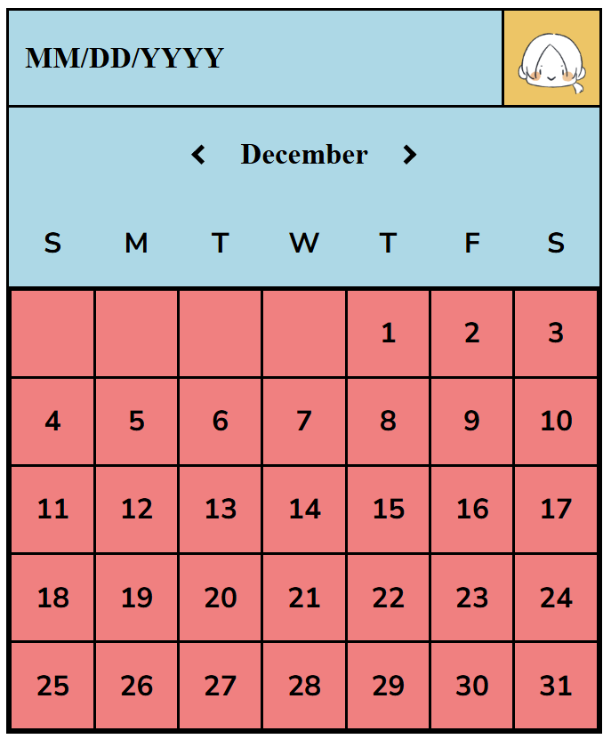

# Datepicker-UI
This project is a simple datepicker UI using HTML and CSS. It is not a functional datepicker, but a static UI component that can later be functional with JavaScript.

# Link to Roadmap.sh
https://roadmap.sh/projects/datepicker-ui

# Objectives of this Project
The goal of this project is to help you practice positioning, layout, and styling techniques in CSS.

# Challenges of this project
A challenge of this project was figuring out the layout of the calendar. I tried to stack tables for the different types of table styles but I did not like how it looked. In the end, while I was doing research about tables and their properties in CSS, I came across the BORDER-COLLAPSE property in tables.

# Screenshot
### Datepicker UI
